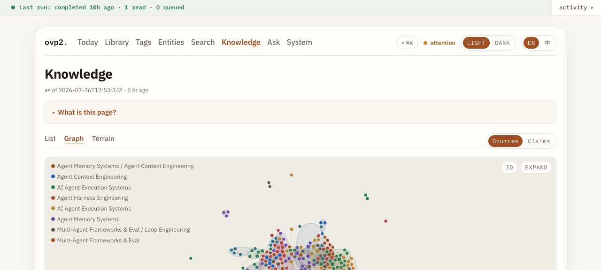
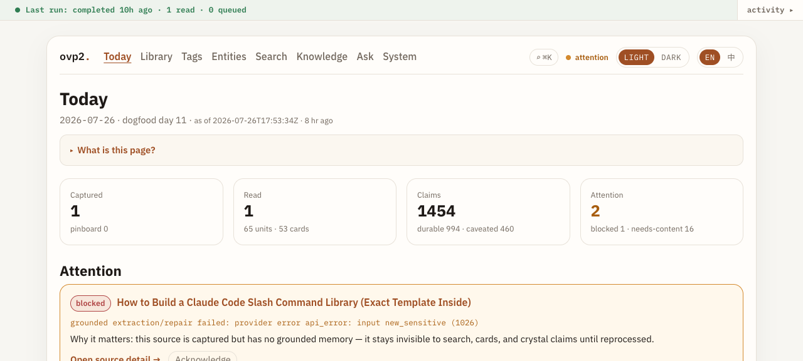
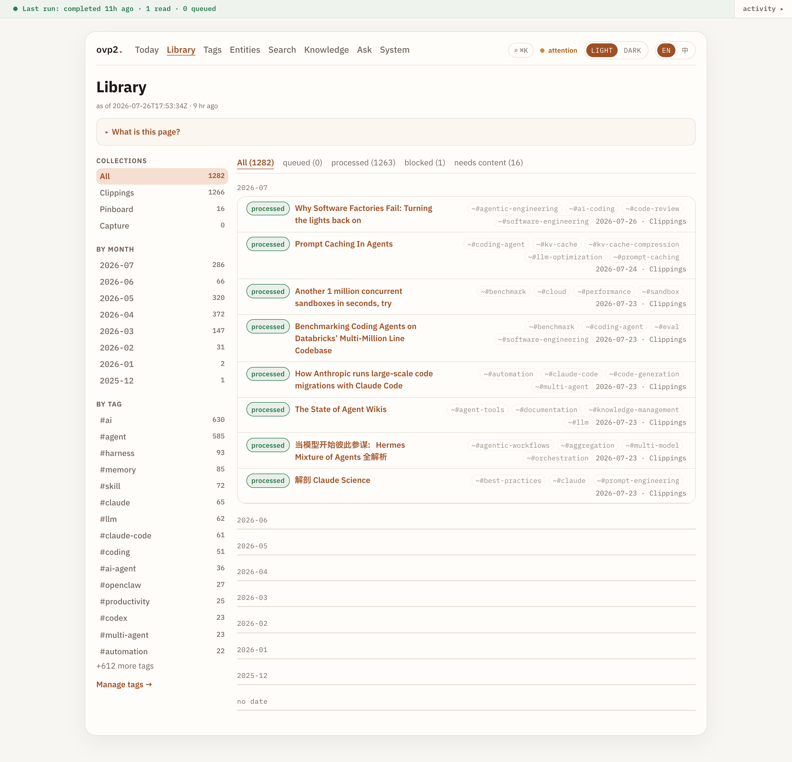
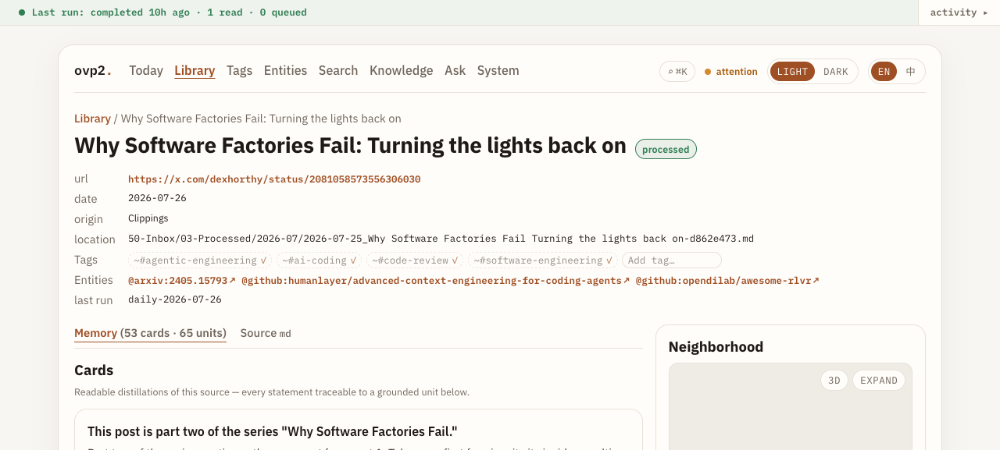
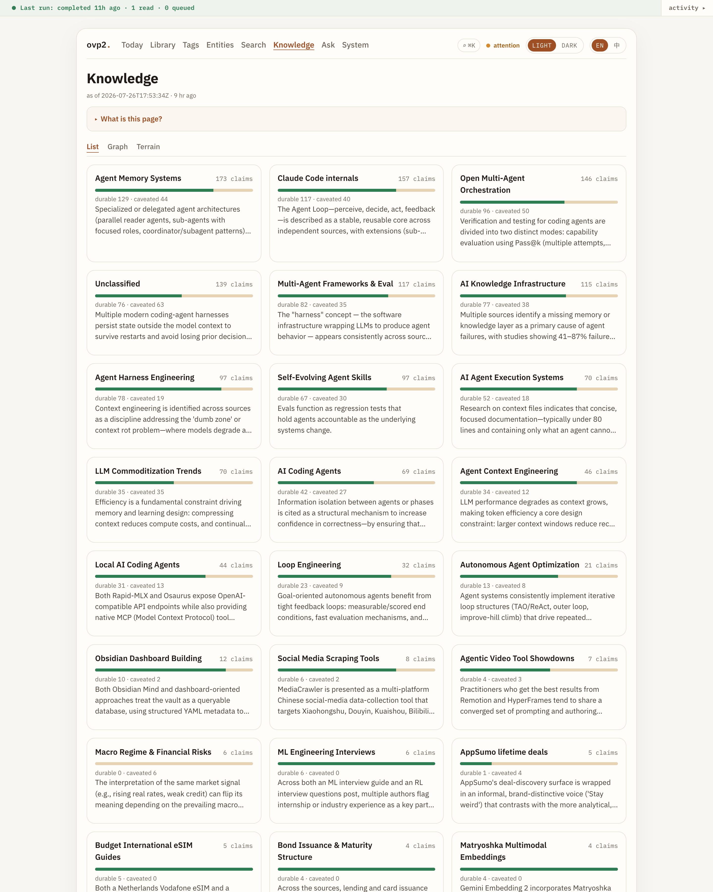
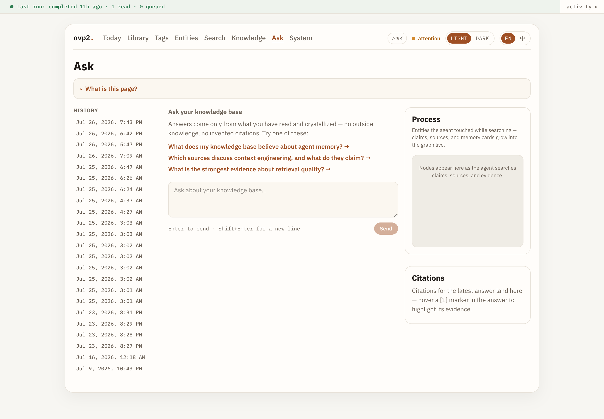
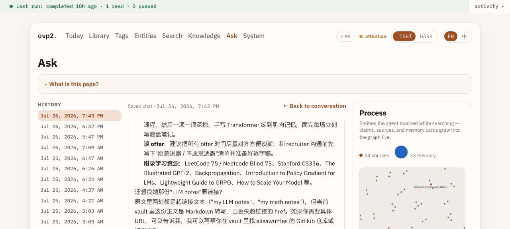
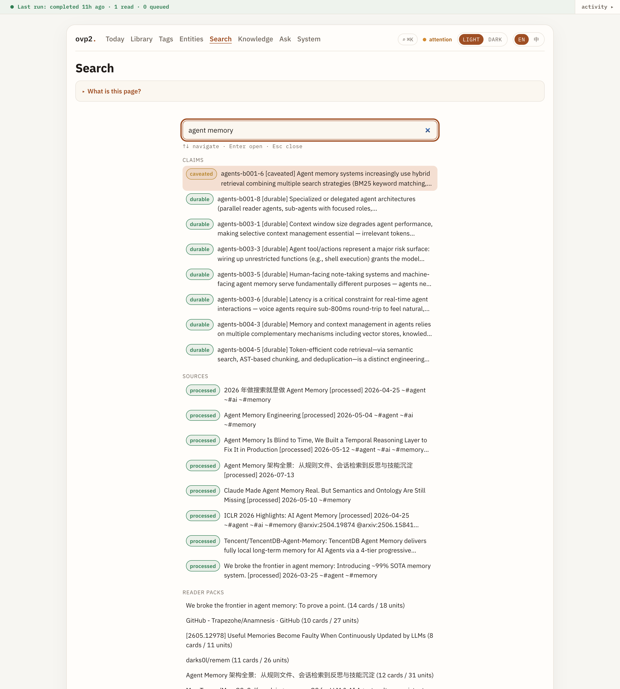

# OVP2 — grounded knowledge for your Obsidian vault

**Turn the articles you save into a knowledge base you can ask — and every answer cites a real line in a real source.**

OVP2 is a local-first app for Obsidian vaults. It reads what you capture, extracts grounded memory, crystallizes durable claims, and gives you a portal to browse, search, and ask — without inventing citations.

[简体中文](README.zh-CN.md) · [Install details](docs/install.md) · [Operator runbook](docs/operator-runbook.md)

<p align="center">
  
</p>

<p align="center"><em>Knowledge graph: themes and claims from a real dogfood vault.</em></p>

---

## Why OVP2

Most note tools store text. OVP2 keeps a **truth layer**:

| Layer | What you see | Rule |
|---|---|---|
| **Source** | Original clippings & bookmarks | Never rewritten |
| **Memory** | Cards & units per article | Every unit ties to a verbatim quote + line |
| **Knowledge** | Cross-source claims | No claim persists without grounded citations |

If a statement cannot point at evidence in your vault, it does not become durable knowledge. Search, the graph, and Ask are projections of that ledger — rebuildable anytime.

---

## The portal

`ovp2 serve` (or the **OVP2 desktop app**) opens a localhost portal over your vault.

### Today — what changed

A morning dashboard: captures, reads, new claims, and items that need attention.

<p align="center">
  
</p>

### Library — everything you captured

Browse by collection and month. Open any source for **memory cards**, the full original
document, and claims that cite it — with a neighborhood graph on the side. Markdown renders
properly, Mermaid diagrams included.

Per source, on demand: a **deep summary**, a **中文 translation**, **companion links** to
related sources, and **chat about this one** — enrichment you ask for, not a bill the daily
loop runs up on everything you ever saved.

<p align="center">
  
</p>

<p align="center">
  
</p>

### Knowledge — themes & claims

Durable vs caveated claims, grouped by theme. Switch **List / Graph / Terrain** when you want structure instead of a spreadsheet of notes.

Each theme also gets a **topic page**: its durable claims woven into prose, where every
sentence cites a claim key. A draft that cannot cite is repaired once, then rejected — the
page never ships ungrounded.

<p align="center">
  
</p>

### Ask — answers with receipts

Ask in natural language. The agent searches claims, sources, and evidence cards; the **Process** panel shows what it touched; the answer carries **numbered citations** you can open.

<p align="center">
  
</p>

<p align="center">
  
</p>

### Search — one box

Sources, claims, packs, themes — and the **full text of every source body**, not just
titles. `⌘K` / `Ctrl+K` from anywhere.

<p align="center">
  
</p>

### 中文 — the knowledge, not just the buttons

The interface has always had a 中文 locale. Beyond that, OVP2 can carry a **Chinese
projection of the knowledge itself**: claims, memory cards, and topic pages get zh versions
alongside the English ones.

It is a *projection*, deliberately — the ledger stays English and single-authority, and the
zh layer is rebuildable from it, so a translation can never become a second source of truth
that quietly disagrees. New material is queued as it arrives and old material backfills in
the background, both inside the vault's own token budget.

Also in the portal: **Tags**, **Entities**, **Work queue** (what enrichment is running, its
pace and ETA), **System** (runs, doctor, LLM settings, schedule). Light *Atelier* and dark
*Vault* themes.

---

## What you run day to day

| You want… | Do this |
|---|---|
| Process the vault once | `ovp2 daily --vault-root ~/path/to/vault --client live` |
| Open the UI | `ovp2 serve --vault-root ~/path/to/vault` → open the printed URL |
| Desktop app | [OVP2.app releases](https://github.com/fakechris/obsidian_vault_pipeline/releases) (macOS) — it carries its own clock, so `ovp2 schedule init` is enough; no OS unit needed |
| Ingest on a schedule, no app running | `ovp2 schedule install` (launchd / systemd user timer) |
| See what the LLM cost you | `ovp2 usage --vault-root …` — tokens by day × lane, against the soft budget |
| Ask from the CLI | `ovp2 ask --vault-root … "your question"` |
| Enrich sources (deep summary, 中文) | `ovp2 source-work --vault-root …` |
| Publish durable knowledge as a public site | `ovp2 publish --vault-root … --out <dir>` |
| Agent tools in an editor | `ovp2 mcp` (stdio MCP: find / search / ask / doctor …) |

The daily loop: capture sweep → grounded read per new source → ledgers → rebuild the read model. Crystal synthesis turns reader packs into cross-source claims behind mechanical gates.

### Bookmarks you never meant to read

Some things you save are entry points, not articles — a brand homepage, a gallery, a docs
index. Tag the capture `ovp_skip` and the pipeline drops it at intake, before it fetches or
spends anything. Remove the tag later and it is picked up again on the next sweep; nothing
is deleted. `ovp_force` is the other direction: read this one even though it is too short to
clear the automatic gate.

We tried to detect these pages automatically and **measured that it does not work** — on a
real 1,448-source corpus the structural signals flagged a 73k-character engineering writeup
and a 46k-character CUDA article next to the three genuine navigation pages. Whether a
bookmark is worth reading is your call, so it stays a tag.

---

## Install

Prebuilt **CLI** for macOS arm64 and Linux x64 (current line: **v2.0.1**). No Rust toolchain required.

```sh
curl --proto '=https' --tlsv1.2 -LsSf \
  https://github.com/fakechris/obsidian_vault_pipeline/releases/latest/download/ovp-cli-installer.sh | sh
```

or:

```sh
brew install fakechris/ovp2/ovp2
```

```sh
ovp2 --version
```

Full channels, desktop DMG, and rollback notes: [`docs/install.md`](docs/install.md).

### Quick start

1. **LLM credentials** (for live reads / Ask) — write `<vault>/.ovp/providers.toml`, which the
   app reads itself. Shell env still wins when set, so one-off overrides keep working.

   ```toml
   [env]
   ANTHROPIC_API_KEY = "sk-ant-..."
   OVP_LLM_TIMEOUT_SECS = "480"

   [budget]
   daily_token_budget = 2000000   # optional; reported by `ovp2 usage`, not enforced
   ```

   The portal's **System → LLM settings** page edits this file for you (keys masked once
   saved). A scheduled job cannot reliably shell-source an env file — that is why this is a
   config file and not `daily.env`.

2. **One daily pass** (try `--dry-run` first):

   ```sh
   ovp2 daily --vault-root ~/Documents/my-vault --client live
   ```

3. **Schedule** (optional):

   ```sh
   ovp2 schedule install --vault-root ~/Documents/my-vault
   ```

4. **Portal**:

   ```sh
   ovp2 serve --vault-root ~/Documents/my-vault
   ```

5. **Pinboard** (optional): `PINBOARD_TOKEN=user:TOKEN` then  
   `ovp2 pinboard-sync --vault-root … --live --max 200`

---

## Privacy & trust

Local-first: product state is plain files under your vault (`.ovp/` ledgers + notes). No account, **no telemetry**.

Only leave the machine when **you** configure them:

- **LLM calls** — text you process is sent to the provider behind your API key (or local endpoint). No key → offline/replay only.
- **Pinboard** — only with `--live` and your token (never logged).
- **Web / GitHub enrichment** — fetches bookmarked URLs (and repo metadata for GitHub links) when enabled.
- **Manual diagnostic compare** — only if you run the compare command against an external service you choose; not part of `daily`.
- **Publishing** — `ovp2 publish` is the only command that pushes anything outward, only to a
  repo you name, and only durable claims.

What it costs is visible too: every metered LLM call lands in `.ovp/usage/`, and
`ovp2 usage` reports tokens by day and by lane against your budget line. The budget is
**soft** — it reports, it does not cut you off mid-run. Per-run limits are the throttle
(`--max-sources`, the enrichment queue's own cap).

---

## More documentation

| Doc | For |
|---|---|
| [`docs/install.md`](docs/install.md) | Installers, desktop, versions |
| [`docs/operator-runbook.md`](docs/operator-runbook.md) | Real-vault operation, failures, recovery |
| [`CLAUDE.md`](CLAUDE.md) | **Contributors: what to rebuild after which change** — a machine with the desktop app installed runs four independent artifacts, and updating the wrong one looks exactly like "my change did nothing" |
| [`docs/ovp-to-ovp2.md`](docs/ovp-to-ovp2.md) | Story of the rewrite & migration ([中文](docs/ovp-to-ovp2.zh-CN.md)) |
| [`docs/architecture.md`](docs/architecture.md) | Crate map & dataflow (engineers) |
| [`docs/product-state-layout.md`](docs/product-state-layout.md) | Where state lives on disk |
| [`CHANGELOG.md`](CHANGELOG.md) | Release history |

Screenshots in [`docs/images/`](docs/images/) were taken from a local dogfood vault (public tech clippings). Re-capture anytime with the portal running; review for secrets before publishing.

---

## Status

Rust workspace (CLI + portal + optional desktop). The daily loop, crystal synthesis, topic
pages, Ask agent, source enrichment, the 中文 projection, and the portal all run on a real
dogfood vault daily — currently ~1,450 sources and ~1,500 durable + caveated claims. See
[releases](https://github.com/fakechris/obsidian_vault_pipeline/releases) for the latest
artifacts.

---

## License

Dual-licensed under either of

- MIT license ([LICENSE-MIT](LICENSE-MIT))
- Apache License, Version 2.0 ([LICENSE-APACHE](LICENSE-APACHE))

at your option. Unless you explicitly state otherwise, any contribution
intentionally submitted for inclusion in this work by you, as defined in the
Apache-2.0 license, shall be dual licensed as above, without any additional
terms or conditions.

Exception: the vendored IBM Plex web fonts
(`console-ui/src/design/fonts/`) remain under the SIL Open Font License 1.1 —
see [`console-ui/src/design/fonts/LICENSE.txt`](console-ui/src/design/fonts/LICENSE.txt).
