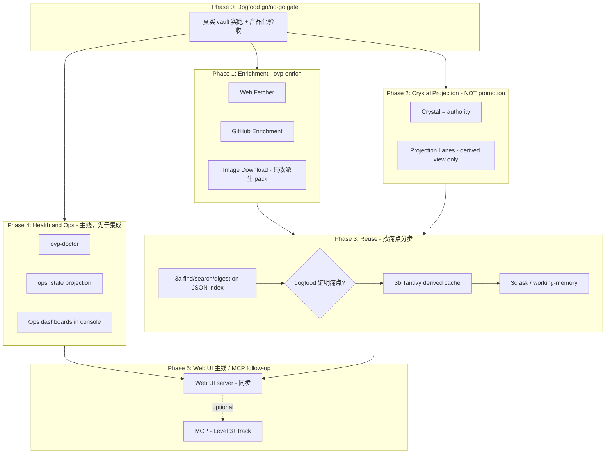

# Level 2 → Level 3：完整 Rust Daily Product 计划（v2.1，已批准为执行基线）

> **状态**：owner（Codex）sign-off —— 批准作为 L2→L3 主计划。v2.1 在 v2 基础上落实执行前要求的 3 处修正：
> (1) axum/tokio 的 gate 事实表述更精确（见 5a）；(2) Phase 2 投影只写 machine-owned block/file，绝不 splice 人类手写内容（见 2b）；(3) digest/working-memory 明确为 ephemeral reuse surface，不进 Crystal ledger（见 3a/3c）。
> Web server 决策已定：**A（同步 server）**。Tantivy 不进默认路线（仅痛点后）。Crystal projection 仅 durable derived view。MCP 留 Level 3+。

> **核心原则（取代旧的「补齐 legacy 命令」目标）**
>
> Level 3 ≠ 复刻所有 legacy 命令。Level 3 = **让 Rust 成为唯一的 daily OVP**：
> 能 capture → intake → daily processing → reader/crystal output → index/search →
> console/ops，Python 不再参与 daily workflow。
> 且全程 **Crystal = authority；vault / console / index 都是 projection**——
> 自动写 vault 只能是「投影视图」，不得复活 canonical/evergreen 的 identity 或 merge 权威。

> v2 修订依据：Codex 战略 review + 对真实代码（M31, `crystal.rs`, `check_architecture.sh`,
> `ovp-index`）的 grounding 三方核验。已修正 6 处会让 CI 变红 / 与数据模型不符的假设，
> 见每个 phase 的 **⚠️ 修正** 标注与文末「v2 变更摘要」。

## 产品决策（已确认 / 已修订）

- **Level 3 门槛**：Rust 独立完成 daily workflow（见核心原则），**不要求**补齐每一行 legacy。
  退出标准是「Python 退出 daily」+ 下列硬 gate，而非「矩阵 0 missing-P1」。
- **Web UI**：要（运营可视化 + 验收需要），保留在 Level 3 主线；**同步实现（决策 A，见 5a）**。
- **MCP**：**降级**为 Level 3+ / integration follow-up，**不是删除 Python 的 blocker**。
- **Enrichment**：网页抓取 + GitHub intake + 图片下载（新 crate `ovp-enrich`，**只做 enrichment，不接管 intake**）。
- **Daemon**：不需要，cron/launchd 调用 `daily` 即可。
- **知识沉淀**：Crystal = authority，vault notes = derived projection（**禁止** canonical merge / evergreen identity）。
- **检索后端**：先用现有 `.ovp/index/index.json`（M31 已落地）；Tantivy 仅在 dogfood 证明查询/排序痛点后引入，且只能是 **derived cache**。

### Level 3 硬退出 gate（缺一不可）

1. Rust 独立跑通 daily（capture→…→console/ops），**连续 2+ 周无 Python fallback**（区别于 Phase 0 的 1-2 周 Level-2 shakedown）。
2. 运营者既有 `knowledge.db` + vault state 的**迁移 or 显式放弃 sign-off**（`stage-m29 §Level 3` 要求，且它是 matrix 里的 `redesigned` 行，「补 P1」永远触发不到）。
3. `cargo test --workspace` + `cargo clippy -D warnings` + `check_architecture.sh` 全绿，且**4 个新 crate 全部纳入 3 道 arch gate**（eval-fence / demoted-import / reqwest-optional）。
4. console/ops 能解释失败、backlog、cost——运营者能每天**只看 Rust 产物**做决策。

## 总体架构方向

依赖要点：Phase 4（ops）在主线上**先于** Phase 5 集成——它决定 daily 能否长期运营。MCP 是侧轨。

---

## Phase 0: Dogfood 稳定化 = 硬 go/no-go gate（1-2 周）

**目标**：真实 vault 连续跑 `ovp2 daily --client live`，验证 M31 闭环。
**当前唯一真实证据只是一次 29 条 clippings 的 dry-run（什么都没写）——本 phase 才是 Level-2 结论本身。未过不进 Phase 1+。**

**产品化验收（不只是「无 panic」）**：

- ✅ 真实 vault 里 daily 产物**人能每天用**（reader pack 可读、provenance 链可点）。
- ✅ console 能**解释失败和 backlog**（Attention feed 指出每个 blocked/needs_content 的原因与动作）。
- ✅ **dedup / retry / blocked 可信**：重复源不重跑、失败自动重试、3 次失败正确 blocked。
- ✅ **没有覆盖用户手写内容**（never-overwrite 实测：手改文件不被 daily 冲掉）。
- ✅ **成本 / 耗时 / 失败分布可见**（run report 里有 token、wall-time、失败模式分类）。
- ✅ 工程底线：连续 7 天无 unhandled panic，blocked 率 < 10%。

**产出**：dogfood report（成功率、失败模式、性能/成本基线）+ **triage 决议**——哪些 edge case 进 Phase 1 范围、**是否已出现 JSON `find` 不够用的查询痛点**（决定 Phase 3b Tantivy 是否启动）。

---

## Phase 1: Enrichment（新 crate `ovp-enrich`，**不接管 intake**）

> **crate 边界（防 god object）**：
> `ovp-intake` = capture / normalize / dedup / lifecycle（**保持 ownership 不动**）；
> `ovp-enrich` = web fetch / GitHub enrichment / image download；
> `ovp-daily` = orchestration only。
> `ovp-enrich` 不得依赖 demoted substrate；reqwest 必须 `optional = true`（invariant #13）。

### 1a. Web Fetcher（bare bookmark → 全文）

- **状态**：**MVP shipped** — trait + fixture/live impls 落地。当前 readability 为 tag-stripping（足以捕获 bare bookmark 文本内容）；article-quality extraction（boilerplate 移除/content scoring）待 dogfood 证明需求后升级至 `dom_smoothie`。
- **架构**：`WebFetch` trait（同 `PinboardFetch`/`AnthropicBlockingClient` 已落地模式）——fixture impl 编译时内置用于测试；live impl behind `web-fetch-live` feature。
- **⚠️ 修正（依赖）**：`readability` crate 已停更（v0.3.0 / 2023-12）。改用维护中的 **`dom_smoothie`**（2026-06 仍活跃），或自行 vet readability 的 html5ever pin。**当前 v1 未引入 dom_smoothie，使用自研 strip-tags 作为 MVP。**
- **⚠️ 修正（集成点）**：插入在 **Phase 2 intake sweep 之后、Phase 3 `plan_daily` 之前**（不是「reader 之前」）。否则 `needs_content` 已被 `plan_daily` 分类并跳过，抓回正文当次 run 不会被规划。
- **安全**：URL allow/deny、超时 30s、内容 ≤ 2MB、rate limit。
- **失败策略**：抓取失败 → 保持 `needs_content`，不 block 其他源。
- **产物**：抓取内容写入对应 capture/raw 文件并更新 frontmatter `fetched_at`；**写发生在该源被 ingest 定身份之前**（避免改动已定 sha256，见 1c 修正）。

### 1b. GitHub Repo Enrichment

- **触发**：intake sweep 识别 `github.com` repo URL（非 issue/PR）。
- **实现**：GitHub API（`GITHUB_TOKEN` env，同 Pinboard 模式，behind `github-live` feature）；拉 README + metadata（description/stars/language/topics）→ 生成标准 vault note。
- **dedup**：复用 `ovp-intake` 的 URL/content dedup（同 repo 不重复入库）。

### 1c. Image / Attachment Download

- **⚠️ 修正（关键）**：**不得原地重写 `01-Raw` 源文件字节**。源文件 byte-sha256 就是 dedup 身份（`ovp-daily/ledger.rs:40`，pack 目录嵌 `hash8` at `lib.rs:279`），且 `ovp-daily/lib.rs:255-263` 有「source changed since plan」TOCTOU 守卫——原地重写会自我 block 或在下次扫描时把同篇文章当新源重摄入（重复 pack + 双倍 LLM 花费）。
- **正确做法（二选一，初版选前者）**：
  - (a) 只在**派生的 reader pack** 内重写 `` → ``，源文件不动；图片下到 `<vault>/attachments/<content-hash>.<ext>`。
  - (b) 若必须改源链接，则把 dedup 身份改成 URL/canonical-content 基础，并先重置 TOCTOU 守卫——这是独立设计项，不在初版。
- **安全**：只下 `image/*`、单张 ≤ 10MB、单源总计 ≤ 50MB；`--no-images` 跳过。

---

## Phase 2: Crystal Projection（**改名：不再叫 Promotion**）

> **⚠️ 战略修正（Codex）**：旧版「Promotion Lanes → 写 `10-Knowledge/Evergreen/`」会复活 demoted 的 evergreen/canonical 权威路线。本 phase 改为 **Crystal Projection Lanes**：vault note 只是 Crystal ledger 的**投影视图**，**禁止** canonical merge、evergreen identity、或把 vault note 当 truth。

### 2a. Projection Lanes（复用已存在的 `final_routing`，不另起规则）

- **⚠️ 修正（数据模型）**：旧版的 `strength >= 8 / 6-7 / < 4` 是错的——`StrengthClass`(`crystal.rs:294-305`) 是 4 值枚举（Supported/Overreach/OverSynthesized/OpinionAsFact），**没有 0-10 分**（唯一数字是 `provenance_score` 0..1）。
- **⚠️ 修正（逻辑已存在）**：`final_routing(provenance, strength) -> FinalClass{Durable|Caveated|Reject}`(`crystal.rs:384-399`) **已实现** AUTO/ESCALATE/REJECT 三分。本 phase 真正新增的只有：(1) 把 `FinalClass` 持久化成可查询的 projection lane；(2) 给 Caveated 加**人工 review 队列**。
- **lane 映射**：`Durable` = 自动投影（AUTO）；`Caveated` = 待人工裁决（ESCALATE），**初版不自动投影**；`Reject` = 不投影。
- **CLI**：`ovp2 project --vault-root ... [--lane durable|review]`（命名用 project，不用 promote）。

### 2b. Crystal → Vault Projection（derived view only）

- **核心**：Crystal ledger 是 truth；vault note 是 rendered view，**可全量重建**（invariant #11）。
- **⚠️ 修正（slug 缺口）**：`DurableRecord`(`crystal.rs:440-456`) **没有 slug/title**（claim 是一句话，key 是 sha256 `claim_key`）。需自定义确定性 **claim→slug 推导（用 `theme` + `claim_key` 前缀）**。**不得 import `CanonicalSlug`**——它在 demoted substrate，且 M31 gate 正则按前缀匹配 `canonical_slug` 会让 CI fail。
- **⚠️ 修正（投影目标）**：避免直接写 `10-Knowledge/Evergreen/`（demoted evergreen 地盘）。投影到**独立目录** `10-Knowledge/Crystal/<slug>.md`，与 demoted evergreen 物理隔离；或正式退役 `EvergreenSink` 后再收编该目录（需单独决策）。
- **⚠️ 修正（写入纪律）**：所有写入走 M31 已落地的 `write_new`/`safe_move`(`vaultops.rs:91-114`，从不覆盖、碰撞加后缀)。「更新已存在笔记的 content section」是**原地覆盖**，`write_new` 结构上不支持——当成独立设计项，需自带幂等 + `before_hash` 守卫，初版**不做原地 splice**。
- **⚠️ 修正（投影范围）**：初版**只投 `FinalClass::Durable`**。Caveated/escalate 暂不投影——M31 已标欠债：`review.json` 是 latest-state render，不是 append-only(`stage-m31:91-93`)。投影 escalate 前先还「caveated 折进 crystal ledger 成 event」这笔债。
- **防护**：vault note 带 `<!-- crystal-managed -->` 标记 + frontmatter `crystal_key`；未标记的同名文件**绝不覆盖**。
- **⚠️ 机器所有权边界（执行前要求）**：初版**不更新任何人类手写 section**——只生成**全机器管理的文件**，或只更新**明确 fenced 的 managed block**（`<!-- crystal-managed:start -->`…`<!-- :end -->`）。任何人类编辑的内容**不参与自动 splice**。明确禁止「智能合并 Markdown」——未来 agent 也不得把 projection 当成可以 merge 人类正文的许可。
- **重投影**：`ovp2 project --rebuild`（从 ledger 全量重建 derived notes）。

---

## Phase 3: Reuse Surfaces（**按痛点分步，防 god object**）

> **⚠️ 战略修正（Codex）**：旧版把 `FTS + ask + digest + working-memory` 塞进一个 phase + 一个 `ovp-memory` crate + 预先定死 Tantivy，容易长成新 god object，且 M31 已决定「FTS 等 query pain 证明再上」。本 phase 改为**先轻后重、按证据进入**。
>
> **ovp-rag 不可复用**：它读 `KnowledgeView` = canonical + knowledge_index = **demoted substrate**(`ovp-query/lib.rs:48-65`)，语料错。其 `retriever.rs` 词法打分可作**模式**借鉴，但必须重指向产品语料（reader cards / crystal / index）。

### 3a. find / search / digest on existing JSON index（**无新依赖，先做**）

- `ovp-index` 的 `run_query`(`query.rs:40-120`) 已能对 claims/packs/cards/sources 做大小写不敏感子串检索——`search`/`digest` 的语料已就绪。
- **⚠️ 定位边界（执行前要求）**：**digest / working-memory 是 ephemeral reuse surface**——是 product output，**不进入 Crystal ledger，不作为 durable truth，不反向驱动 projection**。它们读 product state 生成临时视图，绝不能变成新的 hidden memory store / 第二个知识沉淀层。durable 真相只有一条路：reader → crystal gate → ledger。
- **digest**：`daily` 末尾或独立 `ovp2 digest` → `.ovp/digests/<YYYY-MM-DD>.md`（今日新 packs + crystal 变动 + attention + projection events），LLM synthesis 受 token budget 约束（默认 8k），`--no-digest` 跳过。**遵守 OVP_RULES「不在循环里无限调付费 LLM」**——和 `--max-sources` 同源的速率纪律。

### 3b. Tantivy（**仅在 Phase 0/早期使用证明痛点后启动**）

- **进入条件**：Phase 0 triage 或早期使用**书面记录** JSON 子串 `find` 在性能/排序/召回上不够用。否则不启动。
- **定位**：Tantivy 是 **derived cache**（`.ovp/search/`，可删重建），**不是新 truth store**。纯 Rust、同步，不碰 no-tokio gate。
- **⚠️ 删除**：旧版「tantivy 或 SQLite FTS5」的 SQLite 选项——直接违背 M31 no-SQLite 决定且引入 C 依赖。

### 3c. ask / working-memory（**痛点驱动，先建在 JSON index 上**）

- **ovp-ask**：retrieval（先 JSON index 子串，痛点后换 Tantivy）→ context 组装（reader cards + crystal claims）→ LLM → 带 citation 回答。`ovp2 ask "..."`，可选存 `.ovp/chats/`。
- **working-memory**：预算化上下文包 `.ovp/working-memory.md`（当日 digest + 近 3 天 packs 摘要 + active crystal + user focus），默认 4000 tokens，每次 daily 重建。**同 3a 边界：ephemeral，不进 ledger、不是 durable truth、不反向驱动 projection。**
- **crate 边界**：`ovp-memory` 只读 product state（index + crystal），**只放 retrieval/ask/digest/working-memory**，不接管 projection、不读 demoted canonical。

---

## Phase 4: Health & Ops（**主线，先于 Phase 5 集成**）

> 它决定 daily 能否长期运营，比 MCP/Web 更靠前。

### 4a. ovp-doctor

- 检查项（pass/warn/fail）：ledger↔fs 一致性（processed 记录但文件不在 `03-Processed/`）；orphan packs；stale index（`index.json` 早于最新 ledger entry）；broken internal links；crystal ledger 完整性；per-dir disk usage。
- `ovp2 doctor`，有 fail → exit 1（CI 可用）；`--fix` 只做安全修复（重建 index、orphan 移到 quarantine——**不删除**，遵守 OVP_RULES）。

### 4b. ops_state Projection

- **⚠️ 修正（schema）**：`IndexModel`(`ovp-index/model.rs:133-145`) **当前无 `ops` 字段**。新增 `ops` section 是 `ovp.index/v1` 的 schema bump——加版本说明（projection 可重建，bump 成本低，但要标）。
- 内容：blocked_sources（reasons + retry count + last_attempt）、processing_queue depth、health_summary（doctor 最新结果）、run_stats（近 30 天成功率/平均耗时）。
- 时机：`index` rebuild 时一并计算。

### 4c. Ops Dashboards（扩展 `ovp-console`）

- 新增页面（纯 HTML，同现有 console 架构，从 `IndexModel.ops` 读）：`/ops`（health score / queue / blocked / recent failures）、`/audit`（`pipeline.jsonl` 时间线）、`/candidates`（待 review 的 Caveated projection 候选）。

---

## Phase 5: Integration（Web UI 主线 / MCP 侧轨）

### 5a. Web UI Server（新 crate `ovp-server`，**主线**）

- **功能**：托管 `ovp-console` 输出 + API endpoints（`/api/find`, `/api/search`, `/api/ask`, `/api/doctor`）+ 静态资源内联（无 npm 构建）；仅 localhost bind（默认），`--host` 可选。`ovp2 serve --port 3141`。
- **✅ 决策已定：A（同步 server）**。
- **gate 事实（精确表述）**：当前 `check_architecture.sh` 只 grep 两处 async runtime——`crates/ovp-core/Cargo.toml`（行 65-66）和 **workspace 根 `Cargo.toml`**（行 72-74）。所以 tokio 若**只写在 `crates/ovp-server/Cargo.toml`**，现有 gate **未必会抓到**。因此问题不是「现有 gate 必然变红」，而是：**项目原则上仍是同步 Rust trunk**；一旦引入 axum/tokio，要么**修改并强化 gate**（把检查扩到 server crate / 显式记录例外），要么**明确允许 server crate 成为唯一 async 边界**——两者都得是有记录的决策，不能让依赖偷偷带进来。
- **选 A 的实现**：`tiny_http` / 裸 `std::net::TcpListener`——保住 invariant #6 的同步简洁性，匹配现有 `reqwest::blocking` 先例；live-reload 用 SSE/轮询而非 websocket。等 console/API 真出现并发压力，再单独讨论 async 边界（即 B：axum + tokio + 强化 gate）。
- **并发**：`serve` 是只读面，必须容忍 cron `daily` 并发写（index 在脚下被重建）——靠读快照 + 重读，不持锁。

### 5b. MCP Server（新 crate `ovp-mcp`，**Level 3+ / integration follow-up，非 blocker**）

- **⚠️ 降级**：MCP 是 integration surface，不是 daily pipeline 的核心替代条件——**不卡 Level 3 主线**。
- 真做时：stdio transport（兼容所有客户端）。**⚠️ 删除 `rmcp` 选项**（tokio-based，踩 no-tokio gate）——走计划已提的「**自研同步 stdio JSON-RPC**」（`stdin().lock()` + serde_json，无 runtime）。
- 暴露 tools（复用 `ovp-server` 的同步 handler 实现）：find / search / ask / digest / crystal-status / intake-status / doctor / project；resources：`ovp://working-memory`、`ovp://index`、`ovp://attention`。

---

## Phase 6: Migration Sign-off

- **验证脚本** `scripts/migration_verify.sh`：对比 legacy↔Rust 产物（reader pack 覆盖率、crystal 完整性）；确认 Level 3 硬 gate（见上）全满足；`cargo test` + `clippy` + `check_architecture.sh` 全绿。
- **⚠️ 新增 gate**：4 个新 crate（`ovp-enrich`/`ovp-memory`/`ovp-server`/`ovp-mcp`）全部加入 `check_architecture.sh` 的 eval-fence + demoted-import 检查；`ovp-enrich` reqwest 必须 `optional`。
- **⚠️ 新增 gate**：运营者既有 `knowledge.db` + vault state 的迁移 / 放弃 sign-off；2+ 周无 Python fallback 实跑记录。
- **Python 分类处理**（不是简单 `mv`）：
  - **runtime Python**（参与过 daily 的）：删除或归档。
  - **eval/report scripts**：保留为 `scripts/legacy-eval/`（参考价值）。
  - **one-off migration helpers**：标记「不可作为 product dependency」。
- **文档**：`mainline-return-matrix.md` 最终快照；`operator-runbook.md` 纯 Rust 化；README 更新。

---

## 新 Crate 规划（边界明确，防 god object）

| 新 Crate | 职责（**仅此**） | 不做 | 依赖 |
|----------|------|------|------|
| `ovp-enrich` | web fetch / GitHub enrich / image download | **不接管 intake**（仍归 `ovp-intake`）；不碰 demoted substrate | ovp-domain, reqwest(optional) |
| `ovp-memory` | retrieval / ask / digest / working-memory | 不做 projection；不读 demoted canonical；先 JSON index 后 Tantivy | ovp-domain, ovp-index, ovp-llm,（按痛点）tantivy |
| `ovp-server` | HTTP 托管 console + API + 复用 tool 实现 | 不持业务逻辑；**默认同步**（见 5a 决策） | ovp-index, ovp-memory, ovp-console |
| `ovp-mcp` | stdio JSON-RPC（**自研同步**） | 不持业务逻辑；非 Level 3 blocker | ovp-server tool 实现 |

约束延续（全部进 CI gate）：`ovp-enrich` 不依赖 demoted substrate；`ovp-memory` 只读 product state；server/mcp 是 composition layer。

---

## 时间估算（build effort 小，长杆是观察窗口）

> M30 ≈ 1 session、M31（3 crate + 603 测试）≈ 1 长 session。真正的长杆不是 build，而是**观察 gate**。

| Phase | build effort | 观察 / 前置 gate |
|-------|------|----------|
| Phase 0 | — | **1-2 周真实实跑 = Level-2 go/no-go（硬 gate）** |
| Phase 1 | 小 | Phase 0 过 |
| Phase 2 | 小（多为复用 final_routing） | Phase 0 过 |
| Phase 3a | 小（无新依赖） | Phase 0 过 |
| Phase 3b/3c | 中 | **书面证明查询痛点后才启动** |
| Phase 4 | 中 | Phase 0 过（与 1/2/3a 可并行） |
| Phase 5a | 中（同步 server） | Phase 3 + Phase 4 |
| Phase 5b (MCP) | 小 | **侧轨，不卡主线** |
| Phase 6 | 小 | **+ 2 周无 fallback 实跑 + knowledge.db sign-off** |

主线到 Level 3：build 数周，但 gate 上**至少 1-2 周（Phase 0）+ 2 周（无 fallback）= 一个月起的观察**才是真正决定时间的因素。

---

## 关键风险与缓解

- **axum/tokio 与同步原则**：现有 gate 只查 ovp-core + 根 Cargo.toml，crate-local tokio 未必被抓到（见 5a 精确表述）；真正要守的是「同步 trunk」原则。**已决策 A（同步 server），风险消解**；若未来转 B 需强化 gate + 记录例外。
- **🔴 图片下载破坏 sha256 dedup + TOCTOU**：见 1c，初版只改派生 pack。
- **🔴 Phase 2 复活 canonical/evergreen 权威**：改名 Projection、独立目录、只投 Durable、走 write_new。
- **LLM 成本**：ask/digest/working-memory 都调 LLM → token budget + replay/cache + OVP_RULES 速率纪律。
- **FTS 过早**：Tantivy 按证据进入，default 留 JSON index。
- **dogfood 发现重大缺陷**：Phase 0 是硬 gate——daily 不稳先修再前进，triage 回灌后续范围。

---

## v2 变更摘要（相对旧版）

1. **核心目标重写**：「补齐 legacy 命令」→「让 Rust 成为唯一 daily product」；Crystal=authority/vault=projection 升为贯穿原则。
2. **Phase 2 改名 + 降权**：Promotion → **Crystal Projection**；禁止 canonical/evergreen 权威；修正 strength 数字（复用 `final_routing`）；只投 Durable；自定义 slug（不用 CanonicalSlug）；独立目录；走 `write_new`/`safe_move`。
3. **Phase 3 拆分**：先 `find/search/digest`（JSON index，无新依赖）→ Tantivy/ask/working-memory **按痛点进入**；删 SQLite FTS5 选项；点明 ovp-rag 语料错。
4. **MCP 降级**：从 Level 3 blocker → Level 3+ 侧轨；删 rmcp（用自研同步 stdio）。
5. **Phase 0 产品化验收** + 设为硬 go/no-go gate。
6. **Phase 1 crate 边界**：`ovp-enrich` 只做 enrichment，不接管 intake；修 readability→dom_smoothie；修 web-fetch 插入点（plan 之前）；修图片下载（不改源字节）。
7. **Phase 4 提前**到主线、先于集成；标 `IndexModel.ops` schema bump。
8. **Phase 5a Web UI 决策已定 = A（同步 server）**；gate 事实精确化（crate-local tokio 现有 gate 未必抓得到，真正守的是同步原则）；并发只读模型。
9. **Level 3 硬 gate 重定义**：2 周无 fallback 实跑 + knowledge.db sign-off + 新 crate 入 arch gate，而非「0 missing-P1」。
10. **Phase 6 Python 分类** + 新 gate；时间表改为「build 小 + 观察窗口为长杆」。

**v2.1（owner sign-off 后的 3 处执行前修正）**：(a) 5a axum/tokio gate 事实精确化 + 决策定为 A（同步）；(b) 2b 投影只写 machine-owned block/file，禁止 splice 人类手写内容；(c) 3a/3c digest/working-memory 明确为 ephemeral reuse surface，不进 ledger、不是 durable truth、不反向驱动 projection。
