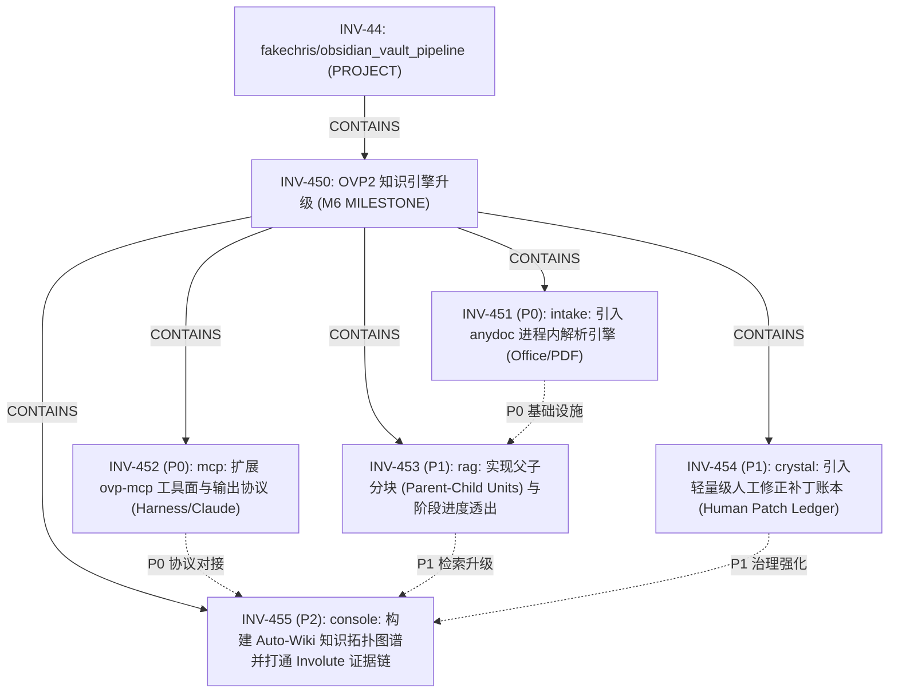

# Stage M37 — OVP2 知识引擎与智能体协同演进：吸收 WeKnora 架构精髓与 Involute 任务闭环

**Type:** Design anchor and evolutionary roadmap (Phase P0 / P1 / P2).  
**Binding:** Involute Milestone `INV-450` under root project `INV-44` (`fakechris/obsidian_vault_pipeline`).  
**Reference Research:** [`docs/research/weknora-architecture-rag-knowledge-study.md`](./research/weknora-architecture-rag-knowledge-study.md).  
**Date:** 2026-09-11.  

---

## 1. 背景与战略定位 (Strategic Positioning)

在深入分析腾讯开源企业级知识库与智能体平台 **Tencent/WeKnora** (v0.8.0) 以及 **Involute**（Agent-Native 项目状态与工作图谱内核）后，OVP2 的核心竞争力与待补全短板清晰呈现：

- **OVP2 核心不可妥协的护城河 (The Moat)**：
  - 纯 Rust 进程内高性能计算，无外部庞杂中间件依赖；
  - 绝对逐字真实性硬门禁：`accepted_without_quote = 0`，机械级 Citation Linter 杜绝文本行漂移；
  - 纯投影（Projection-only）设计：原始数据不可变、中间状态可重现、派生模型全重建。
- **WeKnora 对 OVP2 的关键启示 (Borrowable Strengths)**：
  - **进程内解析能力**：借助 Rust 静态库 `anydoc` 实现 Office/复杂 PDF 无损转 GFM Markdown，直接补全 OVP2 缺乏本地文档抽取的痛点；
  - **切片精度与上下文平衡**：父子分块（Parent-Child Units）解决长文本在向量库中语义稀释问题；
  - **精细化治理与微调**：Chunk 级人工修正补丁与版本回滚机制，避免用户直接修改下游 Markdown 引发数据漂移；
  - **生态外向性**：DeepSeek Harness 插件与丰富 MCP 工具面（Stdio/SSE/HTTP）。
- **Involute 体系的闭环赋能 (Involute Work Graph Binding)**：
  - 严格三层拓扑（Project -> Milestone -> Issue）；
  - CLEAR 客观证据门禁绑定测试结果与引文校验，杜绝知识库“带病入库”。

---

## 2. Involute 任务分解拓扑 (Work Graph Mapping)

本里程碑在 Involute 中已完整登记为 **`INV-450`**，下辖 5 项分解任务：

---

## 3. 三阶段实施蓝图 (Phased Implementation Blueprint)

### 3.1 Phase 1 (近期 P0) — 基础设施与工具面扩展

#### 1. `INV-451`: `ovp-intake` 引入 `anydoc` 纯 Rust 进程内抽取引擎
- **目标**：在不引入 Python 微服务或外部守护进程的前提下，直接在 Rust 进程内完成本地 `.docx`、`.pptx`、`.xlsx` 以及复杂版面 `.pdf` 的抽取与规范化。
- **架构设计**：
  - 在 `crates/ovp-intake` 中实现 `OfficeIngestor`；
  - 继承 WeKnora 在 `anydoc` 上的恶意 PDF 防护规则：显式限制 CID 区间查找预算与页面回溯深度，将最坏执行复杂度限制在 $O(n)$；
  - 输出格式严格对齐 `01-Raw` 标准 GFM Markdown，图文混排资源置入本地 attachment 目录。
- **验收门禁**：`cargo test -p ovp-intake` 覆盖多格式样本文档，解析产物 100% 成功进入 `ovp-reader` 流水线。

#### 2. `INV-452`: `ovp-mcp` 扩展工具面与对齐编码助手协议
- **目标**：将 OVP2 知识检索包装为行业主流编码智能体（Claude Code、Factory Droid、DeepSeek Harness、Cursor）的标准外部工具集。
- **交付范围**：
  - 工具扩展：`ovp_search` (跨泳道混合检索)、`ovp_read_note` (分页规范阅读)、`ovp_list_themes` (主题总览)；
  - 协议优化：引入标准只读注解 (`readOnlyHint`)、截断保护与行号引用；
  - 诊断透出：丰富 `RetrieveCoverage` 输出，清晰标记 Lexical、Semantic 与 Dense 向量泳道当前可用状态。
- **验收门禁**：`cargo test -p ovp-mcp` 测试通过，通过 MCP Inspector 模拟多轮智能体调用验证。

---

### 3.2 Phase 2 (中期 P1) — 检索深度与就地治理升级

#### 3. `INV-453`: `ovp-rag` 实现父子分块 (Parent-Child Units) 与阶段进度流
- **目标**：根除长篇笔记在向量空间中“局部精准度与上下文完整度无法兼顾”的矛盾；改善问答检索黑盒等待体验。
- **交付范围**：
  - 双层分块索引：Child Unit (行/句级粒度，用于密集与词法召回) 映射到 Parent Concept (段落/主题级粒度，用于组装 LLM Prompt)；
  - 检索流水线状态流：在 `ovp-server` 中通过 SSE/WebSocket 阶段化推送 `[retrieving] -> [ranking] -> [synthesizing]` 状态机心跳；
  - 前端交互增强：在 `console-ui` 呈现阶段时间线与带逐字高亮的引用浮层 (Citation Popovers)。
- **验收门禁**：`ovp-rag eval` 基准集评测准确率不退化；`console-ui` 交互无卡顿。

#### 4. `INV-454`: `ovp-crystal` 引入人工修正补丁账本 (Human Patch Ledger)
- **目标**：解决“用户在界面微调断言会导致下游 Markdown 与上游生成账本发生漂移”的痛点。
- **交付范围**：
  - 补丁数据结构：定义 `HumanPatchRecord` (包含目标 Claim ID、原始 quote、微调后的断言文本、操作人、时间戳与校验哈希)；
  - 追加式账本：持久化于 `.ovp/crystal/patches.jsonl`，完全遵守 Append-only 规则；
  - 索引构建器：重新运行 `ovp2 project` 或 `ovp2 index` 时自动叠合有效 Patch，保持源数据不可变与计算可重现；
  - 提供 Diff 比对与一键撤回 (Rollback) 能力。
- **验收门禁**：覆盖补丁冲突、叠加与撤回的单元测试全绿；全库重建后带补丁视图与源事实一致。

---

### 3.3 Phase 3 (远期 P2) — 知识图谱自治与工作流闭环

#### 5. `INV-455`: `console-ui` 构建 Auto-Wiki 知识拓扑图谱并打通 Involute 证据链
- **目标**：实现自维护知识网络的交互式呈现，并将知识沉淀与工程任务闭环结合。
- **交付范围**：
  - 拓扑可视化：在 `console-ui` 中基于 Louvain 社团聚类结果 (`themes.json`) 与双向链接关系渲染交互式力导向图谱；
  - Involute 交付桥接：将 OVP2 知识合成作为 Involute Issue 交付成果，自动挂载 Citation Linter 绿灯报告与测试退出码作为客观 Evidence。
- **验收门禁**：`npm test --prefix console-ui` 绿灯；合成流程生成的 Evidence 附件在 Involute Web UI 正确展示并驱动工作流跃迁。

---

## 4. 架构硬约束与防护边界 (Invariants)

在推进 M37 演进过程中，必须严格坚守以下架构红线：
1. **真实性第一门禁永不降级**：`accepted_without_quote = 0` 是 OVP2 系统的绝对基石，无论分块如何细化，任何未通过逐字匹配的断言坚决不能进入 Durable Store。
2. **读写分离与不可变源文件**：Office 抽取与补丁账本均不得原地篡改用户原始笔记文件，所有改动必须经由 `.ovp/` 账本和只读 Reader 包进行衍生记录。
3. **Involute 严格拓扑纪律**：任何后续派生子任务必须绑定 `INV-450` 父节点，严禁产生游离于 Milestone 之外的孤儿 Issue。
